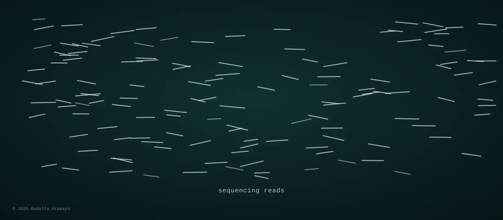

<!--
**raramayo/raramayo** is a ✨ _special_ ✨ repository because its `README.md` (this file) appears on your GitHub profile.

Here are some ideas to get you started:
## Hi there 👋
- 🔭 I’m currently working on ...
- 🌱 I’m currently learning ...
- 👯 I’m looking to collaborate on ...
- 🤔 I’m looking for help with ...
- 💬 Ask me about ...
- 📫 How to reach me: ...
- 😄 Pronouns: ...
- ⚡ Fun fact: ...
-->

<!-- 
 -->
<!--   <picture> -->
<!--     <source media="(prefers-color-scheme: dark)"  srcset="assets/genome_banner_dark.svg"> -->
<!--     <source media="(prefers-color-scheme: light)" srcset="assets/genome_banner_light.svg"> -->
<!--     
<!--          alt="Sequencing reads assembled into contigs, scaffolds and chromosomes; RNA-seq reads mapped to a locus; a gene model, spliced mRNA and a translated, folded protein" -->
<!--          width="100%"> -->
<!--   </picture> -->
<!-- 
 -->

  <picture>
    <source media="(prefers-color-scheme: dark)"  srcset="assets/genome_banner_dark.webp">
    <source media="(prefers-color-scheme: light)" srcset="assets/genome_banner_light.webp">
    
  </picture>

